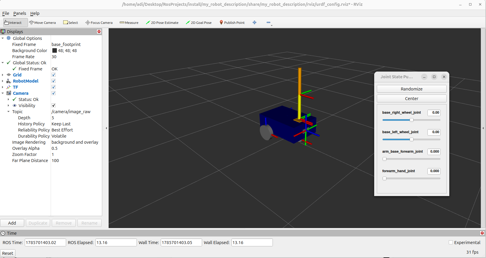
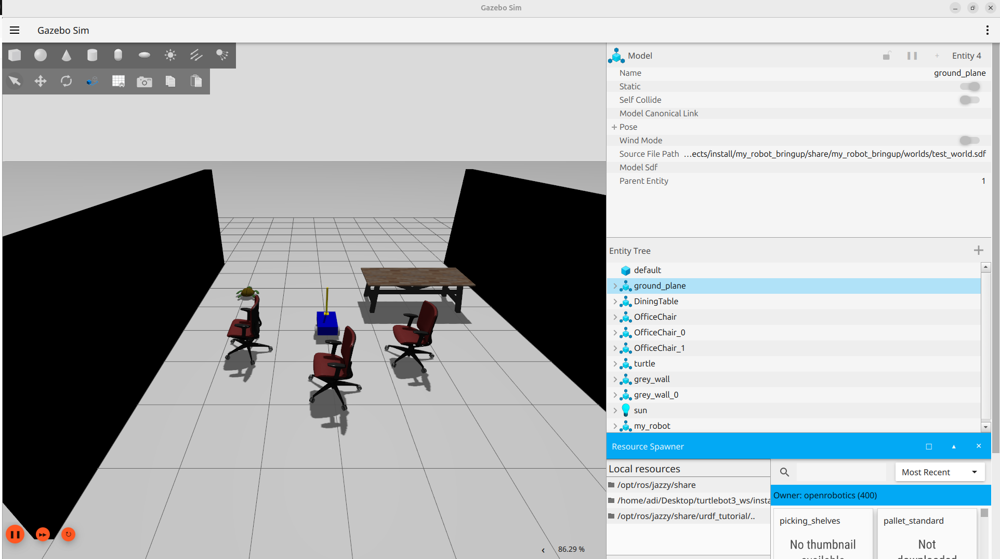
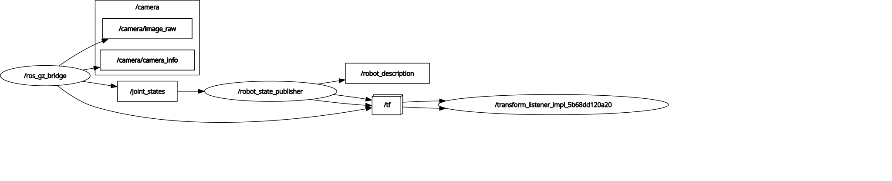

# 🤖 Mobile Manipulator Robot using ROS 2 Jazzy & Gazebo Sim
# 🤖 Mobile Manipulator Robot using ROS 2 Jazzy & Gazebo Sim


A complete ROS 2 simulation of a differential-drive mobile manipulator built using **ROS 2 Jazzy**, **Gazebo Sim**, **RViz2**, **URDF/Xacro**, and **ros_gz**.

This project demonstrates robot modeling, simulation, visualization, and ROS-Gazebo integration using a modular package structure.

---

# Features

- 🚗 Differential Drive Mobile Base
- 🦾 2-DOF Robotic Arm
- 📷 RGB Camera Sensor
- 📡 ROS 2 Jazzy
- 🌍 Gazebo Sim Integration
- 🎯 RViz2 Visualization
- 🔄 Robot State Publisher
- ⚙️ Joint State Publisher GUI
- 🌉 ROS ↔ Gazebo Bridge
- 📦 Modular URDF/Xacro Design
- 🏗️ Custom Gazebo World

---

# Project Structure

```text
ROSProjects/
│
├── .vscode/                    # VS Code configuration
├── build/                      # Colcon build artifacts
├── install/                    # Installed ROS packages
├── log/                        # Colcon build logs
├── maps/                       # Maps used for navigation/SLAM
│
├── my_py_pkg/                  # Standalone Python package
│
├── src/
│   ├── my_robot_description/
│   │   ├── launch/
│   │   ├── rviz/
│   │   ├── urdf/
│   │   ├── config/
│   │   ├── package.xml
│   │   └── CMakeLists.txt
│   │
│   ├── my_robot_bringup/
│   │   ├── launch/
│   │   ├── worlds/
│   │   ├── config/
│   │   ├── package.xml
│   │   └── CMakeLists.txt
│   │
│   └── my_robot_interfaces/
│       ├── action/
│       ├── msg/
│       ├── package.xml
│       └── CMakeLists.txt
│
├── README.md
├── rosgraph.svg
│
├── frames_*.gv                 # Generated TF graph source files
├── frames_*.pdf                # Generated TF tree PDFs
├── my_robot_hand.gv            # Robot TF graph
└── my_robot_hand.pdf           # Robot TF visualization
```

# Robot Description

The robot consists of the following components:

## Mobile Base

- Differential drive robot
- Two powered wheels
- One caster wheel
- Base footprint
- Base link

---

## Robotic Arm

- Two revolute joints
- Arm base
- Forearm
- End-effector (Hand)

---

## Camera

- RGB Camera
- Camera Optical Frame
- Gazebo Camera Plugin

---

# Software Stack

| Component | Technology |
|------------|------------|
| Operating System | Ubuntu 24.04 |
| ROS Distribution | ROS 2 Jazzy |
| Simulator | Gazebo Sim |
| Robot Description | URDF + Xacro |
| Visualization | RViz2 |
| Programming Language | Python |
| Build System | Colcon |
| Middleware | DDS |
| Version Control | Git |

---

# ROS Packages

## my_robot_description

Contains

- Robot URDF/Xacro
- Robot meshes
- Gazebo plugins
- RViz configuration
- Robot launch files

---

## my_robot_bringup

Contains

- Gazebo launch files
- Simulation world
- Gazebo bridge configuration

---

## my_robot_interfaces

Contains custom ROS interfaces used by the project.

---

## my_py_pkg

Contains Python ROS nodes used for testing and experimentation.

---

# Dependencies

- ROS 2 Jazzy
- Gazebo Sim
- ros_gz
- RViz2
- robot_state_publisher
- joint_state_publisher_gui
- xacro
- tf2
- Colcon

---

# Installation

Clone the repository

```bash
mkdir -p ~/RosProjects/src

cd ~/RosProjects/src

git clone https://github.com/<YOUR_USERNAME>/<YOUR_REPOSITORY>.git
```

Build the workspace

```bash
cd ~/RosProjects

source /opt/ros/jazzy/setup.bash

colcon build

source install/setup.bash
```

---

# Running the Project

## Display Robot in RViz

```bash
ros2 launch my_robot_description display.launch.xml
```
## RViz Visualization

<p align="center">

</p>
---

## Launch Gazebo Simulation

```bash
ros2 launch my_robot_bringup my_robot_gazebo.launch.xml
```
## Gazebo Simulation

<p align="center">

</p>
---

## Visualize TF Tree

```bash
ros2 run tf2_tools view_frames
```
<h2>ROS Graph</h2>

<p align="center">
  
</p>
## 🎮 Robot Control

After launching the Gazebo simulation, you can control the mobile base and robotic arm using the following commands.

### Move the Mobile Base

Open a new terminal and run:

```bash
ros2 run teleop_twist_keyboard teleop_twist_keyboard
```

Use the keyboard controls displayed in the terminal to drive the robot.

### Move the Robotic Arm

#### Joint 0 (Base Joint)

Move Joint 0 to **0.8 radians**:

```bash
ros2 topic pub -1 /joint0/cmd_pos std_msgs/msg/Float64 "{data: 0.8}"
```

#### Joint 1 (Forearm Joint)

Move Joint 1 to **0.8 radians**:

```bash
ros2 topic pub -1 /joint1/cmd_pos std_msgs/msg/Float64 "{data: 0.8}"
```

### Example

1. Launch the simulation.
2. Open a new terminal.
3. Drive the robot using:

```bash
ros2 run teleop_twist_keyboard teleop_twist_keyboard
```

4. Open another terminal and move the arm:

```bash
ros2 topic pub -1 /joint0/cmd_pos std_msgs/msg/Float64 "{data: 0.8}"

ros2 topic pub -1 /joint1/cmd_pos std_msgs/msg/Float64 "{data: 0.8}"
```
---

# TF Tree

```
base_footprint
│
└── base_link
    ├── left_wheel_link
    ├── right_wheel_link
    ├── caster_wheel_link
    ├── arm_base_link
    │   └── forearm_link
    │       └── hand_link
    └── camera_link
        └── camera_link_optical
```

---

# Gazebo Plugins

The simulation uses the following Gazebo plugins:

- Differential Drive Controller
- Joint State Publisher
- Joint Position Controller
- RGB Camera Sensor

---

# Technologies Used

- ROS 2 Jazzy
- Gazebo Sim
- RViz2
- URDF
- Xacro
- TF2
- Robot State Publisher
- Joint State Publisher GUI
- ros_gz_bridge
- ros_gz_sim
- Colcon
- Git

---

# Future Improvements

- Navigation2 (Nav2)
- SLAM Toolbox
- MoveIt 2 Integration
- ros2_control
- LiDAR Integration
- Autonomous Navigation
- Pick and Place
- Object Detection
- Real Robot Deployment
- Hardware Interface

---


# Learning Outcomes

This project demonstrates practical experience with:

- ROS 2 Package Development
- Robot Modeling using URDF/Xacro
- Gazebo Simulation
- RViz Visualization
- ROS Launch Files (Python & XML)
- TF Tree Management
- Robot State Publisher
- Joint State Publisher
- ROS-Gazebo Integration
- Modular Robot Design
- Simulation Environment Setup

---

# Author

**Aditya Singh**

**Systems Engineer | Robotics | Embedded Systems | ROS 2 Developer**

GitHub: https://github.com/adityasinghmech007

LinkedIn: <https://www.linkedin.com/in/adityasingh2024/>

---

